

### Hello👋

### 👀 I'm ...

 🌟 23 years old  
 🌟 majoring in **Computer Science & Engineering** at Chung-Ang Univ. (2021 ~ ) 
 🌟 **LikeLion at CAU** 11th 
 🌟 **COMP** 36th 

### 🤸 I like ...

⚾ Baseball
🎶 Music

### 🌱 I’m studying ...

</a>
</a>
</a>

</a>
</a>
</a>
</a>

</a>
</a>

### Week 3
⚽️ **스탠다드** 
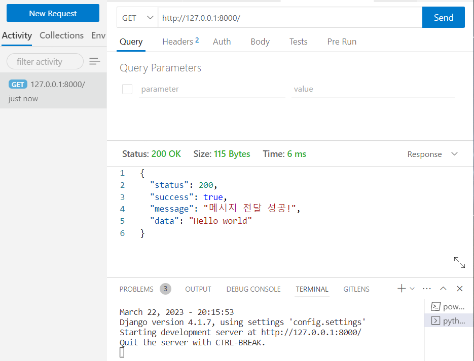</a>  
⚾️ **챌린지** 
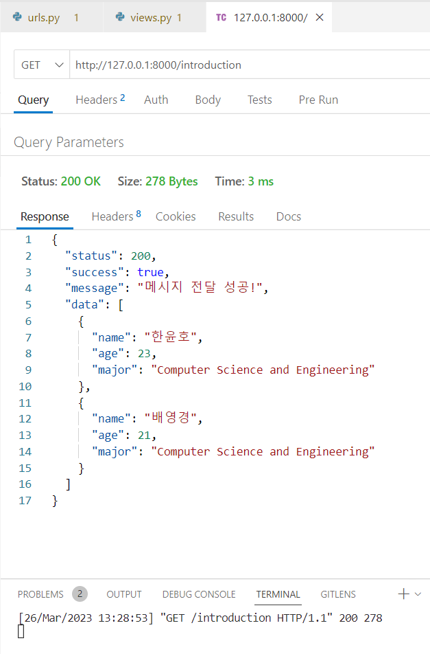</a>  

### Week 4
⚽️ **스탠다드** 
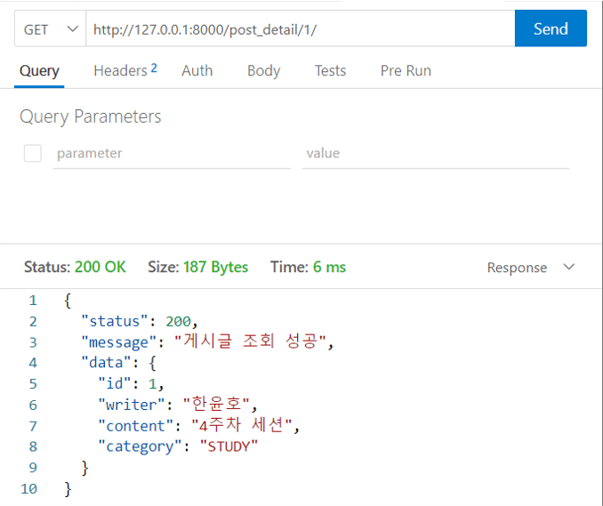</a>  
⚾️ **챌린지** 
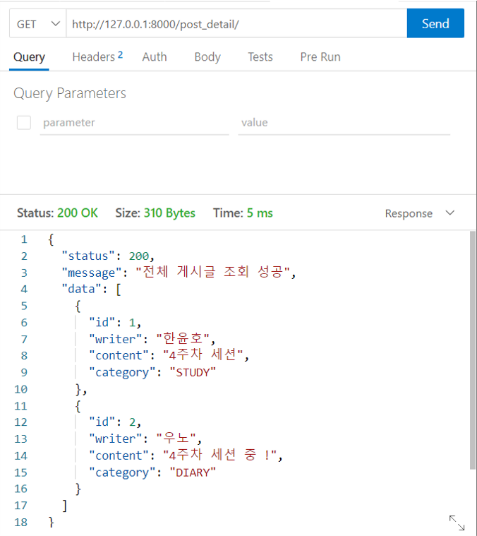</a>  

### Week 5
⚽️ **스탠다드** 
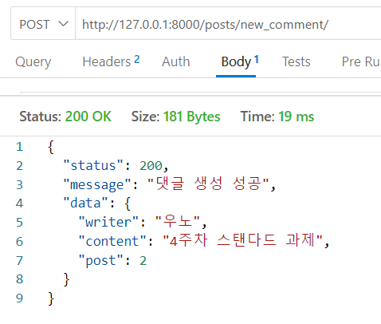</a>  
⚾️ **챌린지** 
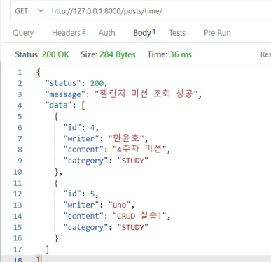</a>  

### Week 6
⚽️ **스탠다드** 
http://likelion-11th-uno.kro.kr:8000/ 

### Week 7
🧸**토이 프로젝트**🧸 
https://github.com/hnnynh/Toy-Project-Server 

### Week 8
⚽️ **스탠다드** 
복습 및 주석 달기 !  
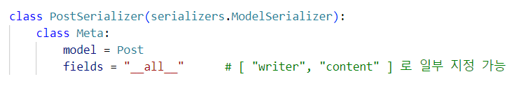</a> 
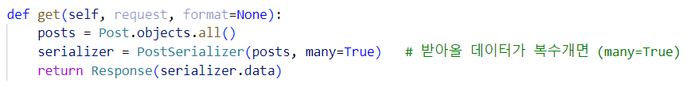</a> 
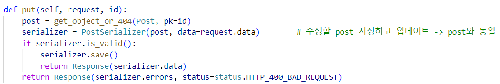</a> 
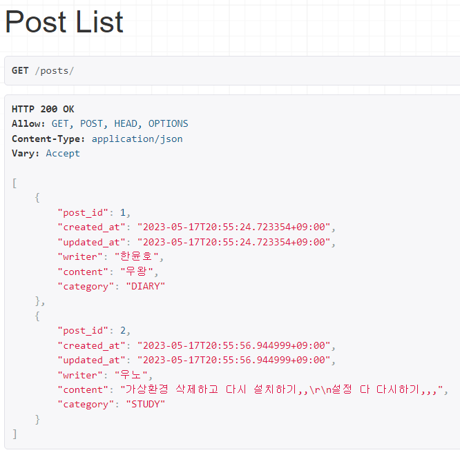</a> 
 
⚾️ **챌린지** 
Comment API View로 구현하기 
해당하는 post의 comment 볼 수 있도록 구현 !  
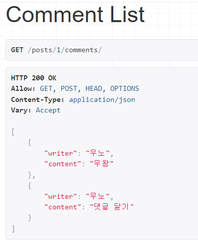</a>  

### Week 9
⚽️ **스탠다드** 
복습 및 주석 달기 !  
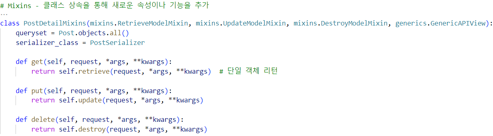</a> 
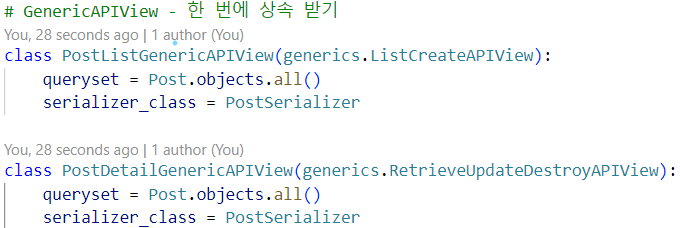</a> 
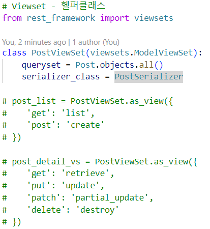</a> 
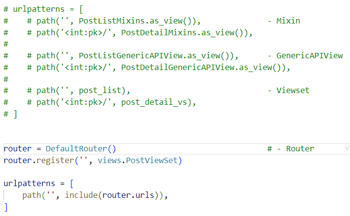</a> 
 
⚾️ **챌린지** 
Comment Class View로 구현하기 
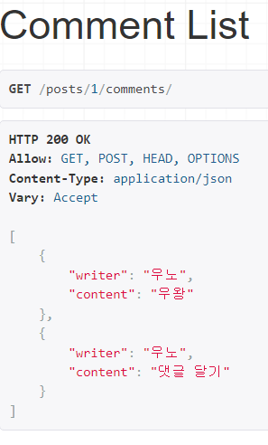</a>  

### Week 10
⚽️ **스탠다드** 
복습 및 주석 달기 !  
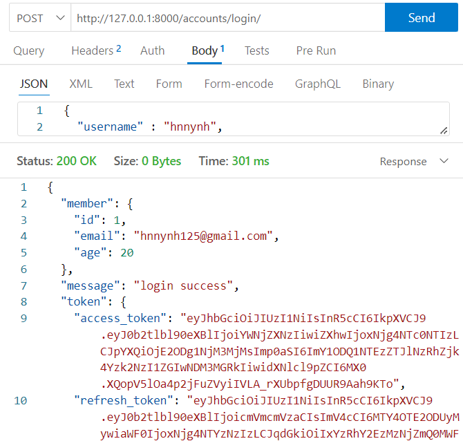</a> 
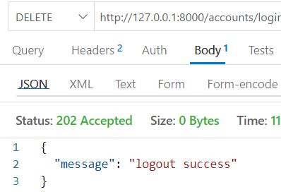</a> 
 
⚾️ **챌린지** 
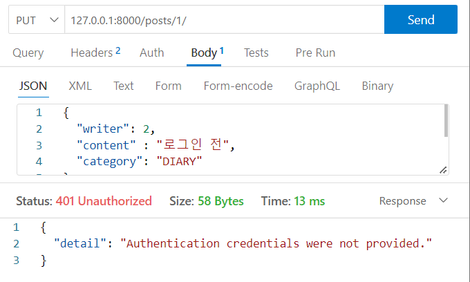</a> 